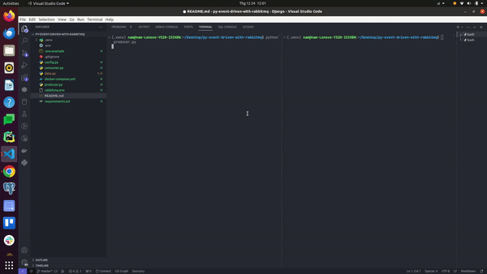

# Python Application with RabbitMQ using Docker Compose

This repository contains a basic setup for a Python application interacting with RabbitMQ using Docker Compose.

### Preview


## Prerequisites

- Docker installed on your machine. You can download it from [Docker's official website](https://www.docker.com/products/docker-desktop).

## Getting Started

1. Clone this repository:

    ```bash
    git clone https://github.com/namkata/py-event-driven-with-rabbitmq.git
    cd py-event-driven-with-rabbitmq
    ```
2. Set up your `.env` file:

    Create a `.env` file in the root directory of the project and add the following environment variables:

    ```dotenv
    RABBITMQ_HOST=rabbitmq
    RABBITMQ_PORT=5672
    RABBITMQ_USERNAME=moeuxdkz
    RABBITMQ_PASSWORD=w3rk9qZsz7ZTJ-VEJAX0LIFW8Z9M0szN
    RABBITMQ_VHOST=moeuxdkz

    RABBITMQ_EXCHANGE_NAME=my_exchange
    RABBITMQ_EXCHANGE_TYPE=direct
    RABBITMQ_ROUTING_KEY=my_routing_key
    RABBITMQ_QUEUE_NAME=my_queue
    ```
3. Start the services:

    Run the following command to start the application and RabbitMQ services:

    ```bash
    docker-compose up
    ```

    Run producer and consumer:
    ```bash
    python producer.py
    ```
    ```bash
    python consumer.py
    ```
## Structure
```
.
├── config.py
├── consumer.py
├── data.py
├── docker-compose.yml
├── producer.py
├── rabbitmq.env
├── README.md
└── requirements.txt
```
The project directory contains the following files:

- `config.py`: This file includes configuration settings for interacting with RabbitMQ, such as connection parameters and setup.
- `consumer.py`: This script is responsible for consuming messages (invoices in this case) from RabbitMQ and processing them accordingly.
- `data.py`: This file might contain data structures, utilities, or functions related to handling data within the application.
- `docker-compose.yml`: This YAML file defines Docker services for running RabbitMQ and the Python application.
- `producer.py`: The producer script generates and publishes invoices or messages to RabbitMQ.
- `rabbitmq.env`: This file contains environment variables for configuring RabbitMQ, such as host, port, username, password, etc.
- `README.md`: This file serves as the project's README, providing information about the project setup, structure, and usage instructions.
- `requirements.txt`: This file lists the required Python packages and their versions needed to run the application. Use `pip install -r requirements.txt` to install these dependencies.
  
Here is an example work Event driven of RabbitMQ, I hope this is helpful to you.

Thanks